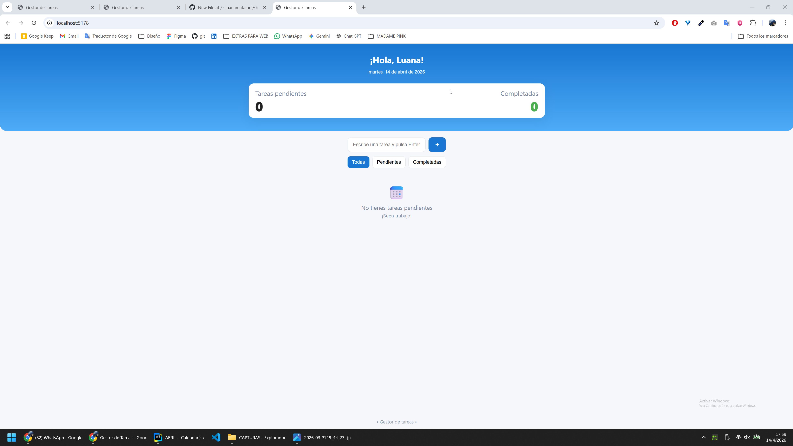

# Gestor de Tareas (Vite + React)



Pequeña aplicación de ejemplo hecha con React y Vite para gestionar tareas. Incluye selección de prioridad (con un pequeño indicador de color) y un calendario emergente con animación suave.

## Características
- Crear, editar y eliminar tareas.
- Prioridades (Baja / Media / Alta) con badge de color en el selector.
- Selector de fecha por calendario con animación al abrir/cerrar.
- Proyecto frontend servido con Vite.

## Requisitos
- Node.js (recomendado >= 20)
- npm (incluido con Node)

Si usas nvm (Windows), puedes fijar/usar la versión 20:

```cmd
nvm install 20
nvm use 20
node -v
```

## Instalación
Desde una consola (cmd.exe):

```cmd
cd C:\Users\Pulgita\Desktop\ABRIL
npm install
```

## Ejecutar en modo desarrollo
Arrancar el servidor de desarrollo (Vite):

```cmd
npm run dev
```

Vite mostrará una URL (p. ej. http://localhost:5173). Ábrela en tu navegador.

## Build y preview
Generar la build para producción:

```cmd
npm run build
```

Probar la build localmente:

```cmd
npm run preview
```

## Inicializar git (opcional)
Si quieres versionar el proyecto:

```cmd
git init
git add .
git commit -m "chore: inicializar repo"
```

## Rutas importantes
- `src/App.jsx` — componente principal y modal de edición.
- `src/Crear_Tarea.jsx` — modal de creación de tareas.
- `src/Calendar.jsx` — componente de calendario reutilizable.
- `src/styles.css` — estilos globales y animaciones.

## Personalización rápida
- Animación del popover del calendario: ajustar duración en `src/styles.css` (clases `.calendar-popover`, `.calendar-popover.open`, `.calendar-popover.closing`).
- El desmontaje del popover usa un timeout JS (p. ej. 220ms) en `src/App.jsx` y `src/Crear_Tarea.jsx`; si cambias la duración CSS, ajusta ese timeout para que coincida.

## Troubleshooting
- Error "Unexpected end of file" al iniciar Vite: suele indicar un caracter sobrante o un cierre de paréntesis faltante en un `.jsx` — revisa el archivo que menciona el error (por ejemplo `src/Calendar.jsx`).
- Si el dev server muestra comportamientos extraños tras cambios en CSS/JS: detener el server (Ctrl+C) y volver a ejecutar `npm run dev`.
- Limpiar cache de Vite (Windows):

```cmd
rd /s /q .vite
npm run dev
```

## Contribuciones
Si quieres colaborar, haz fork/branch y abre un PR con cambios pequeños y descriptivos.

---
Si quieres, puedo también:
- Añadir un `README` más largo con capturas y ejemplos en GIF.
- Crear plantillas de issues y un `.gitattributes`.
Dime qué prefieres y lo implemento.
